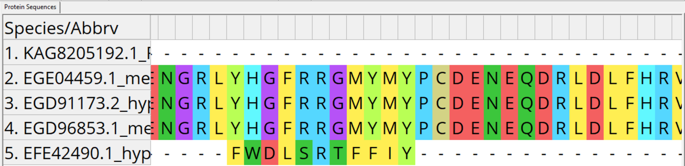
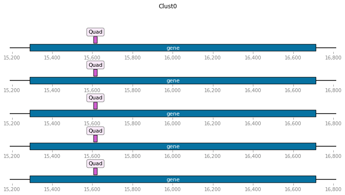
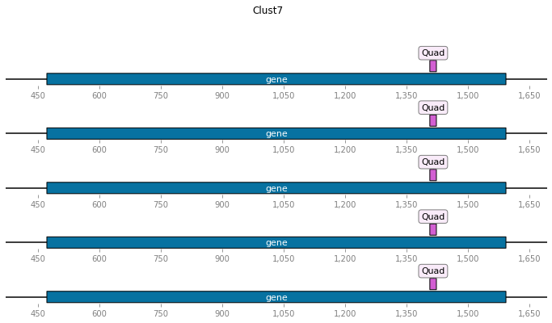
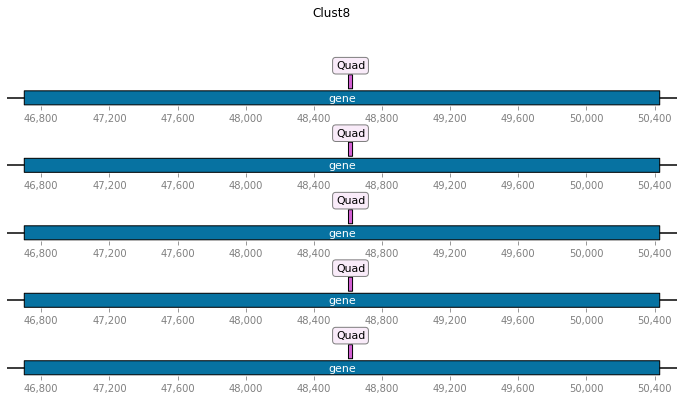

# Bioi. Final Project

Код: [Google Colaboratory](https://colab.research.google.com/drive/1tgZfFJiV4eQ1YMJ1tQzrrg3YtrPfwyJa?usp=sharing)

_Все закоммитить не получалось, поэтому часть файлов тут:_ [Google Drive](https://drive.google.com/drive/folders/1NW5ceMD-ih3LqtbeVqI9Si6CYSH1do5h?usp=sharing)

Царство: Fungi

Таксон: Ascomycetes

Род: Trichophyton

Organism name              | Assembly level | Size (Mb) | GC%  | Scaffolds
:-------------------------:|:--------------:|:---------:|:----:|:---------:
Trichophyton verrucosum    | Scaffold       | 22.54     | 48.2 | 523
Trichophyton rubrum        | Scaffold       | 22.53     | 48.3 | 36
Trichophyton interdigitale | Scaffold       | 22.04     | 48.7 | 815
Trichophyton equinum       | Scaffold       | 24.16     | 47.3 | 125
Trichophyton tonsurans     | Scaffold       | 22.99     | 48.1 | 111

## Анализ аннотированных генов

Вид                        | Длина файла | Число аннотированных генов | Доля аннотированных генов | Доля покрытия экзонов
:-------------------------:|:-----------:|:--------------------------:|:-------------------------:|:---------------------:
Trichophyton verrucosum    | 22540967    | 8086                       | 57.00%                    | 52.25%
Trichophyton rubrum        | 22530013    | 8713                       | 64.79%                    | 77.31%
Trichophyton interdigitale | 22044533    | 7600                       | 87.67%                    | 51.15%
Trichophyton equinum       | 24158205    | 8785                       | 57.36%                    | 49.76%
Trichophyton tonsurans     | 22988586    | 8625                       | 59.61%                    | 52.45%

### Координаты

Список координат получился очень большим (по таблице сверху), его получение приведено в [блокноте](https://colab.research.google.com/drive/1tgZfFJiV4eQ1YMJ1tQzrrg3YtrPfwyJa?usp=sharing). Ниже указаны некоторые гены для Trichophyton verrucosum:

```python
[{'TRV_08162': [309, 1361],
  'TRV_08163': [1709, 2284],
  'TRV_08164': [2408, 4093],
  'TRV_08165': [4413, 5753],
  'TRV_08159': [19, 615],
  'TRV_08160': [731, 2071],
  'TRV_08161': [2399, 2584],
  'TRV_08156': [1387, 3855],
  'TRV_08157': [4484, 5503],
  'TRV_08158': [6790, 7296],
  'TRV_08153': [65, 1279],
  ...
```

## Участки Z-ДНК

Вид                        | Предсказано участков | Средний ZH-Score | Общая длина | Средняя длина
:-------------------------:|:--------------------:|:----------------:|:-----------:|:-------------:
Trichophyton verrucosum    | 29315                | 2315.07          | 291426      | 9.94
Trichophyton rubrum        | 28033                | 2387.64          | 278712      | 9.94
Trichophyton interdigitale | 29838                | 2541.12          | 297894      | 9.98
Trichophyton equinum       | 30115                | 2271.77          | 300488      | 9.98
Trichophyton tonsurans     | 29564                | 2215.61          | 294636      | 9.97

Вид                        | Общий график                   | Приближение
:-------------------------:|:------------------------------:|:-----------------------------------:
Trichophyton verrucosum    |  | 
Trichophyton rubrum        |  | 
Trichophyton interdigitale |  | 
Trichophyton equinum       |  | 
Trichophyton tonsurans     |  | 

По графику видно, что большинство участков имеют довольно низкий z-score, это положительно коррелирует с тем, что нам рассказывали о Z-ДНК на прошлом курсе майнора (2 из 4 семестров): левозакрученная спираль ДНК не является наиболее распространенной.

Также в Trichophyton interdigitale наивысший показатель ZH-Score, не смотря на относительно маленькую длину генома, это можно объяснить тем, что в этом геноме наивысший процент аннотированных генов. Рассмотрим наложение Z-ДНК на гены в следующем разделе.

## Ассоциация предсказанных участков Z-DNA с промотерами генов

В приведенном [Google Colab](https://colab.research.google.com/drive/1tgZfFJiV4eQ1YMJ1tQzrrg3YtrPfwyJa?usp=sharing) мы создали .bed файлы и провели пересечение разметок, вот что получилось на примере 10 генов каждого организма:

Trichophyton verrucosum


Trichophyton rubrum


Trichophyton interdigitale


Trichophyton equinum


Trichophyton tonsurans


Вид                        | Гистограмма
:-------------------------:|:-----------:
Trichophyton verrucosum    | 
Trichophyton rubrum        | 
Trichophyton interdigitale | 
Trichophyton equinum       | 
Trichophyton tonsurans     | 

## Кластеризация

Чтобы быстрее посчитать кластеры, перейдем на сервер (в колабе 2 ядра, а на сервере 8).


По гистограмме можно частично оценить работу кластеризатора: подавляющее большинство кластеров ключают 5 из 5 видов.

Всего нашлось 5278 кластеров. На промотеры попало 4270. Из них выбраны 10 с самым высоким ZH-Score (в среднем по кластеру):

<table class="tg">
<thead>
  <tr>
    <th class="tg-0pky">Кластер</th>
    <th class="tg-0pky">Число генов</th>
    <th class="tg-0pky">Вид</th>
    <th class="tg-0pky">Белок</th>
    <th class="tg-0pky">Ген</th>
    <th class="tg-0lax">Средний ZH-Score</th>
    <th class="tg-0pky">Средний ZH-Score по всем</th>
    <th class="tg-0pky">Функция</th>
  </tr>
</thead>
<tbody>
  <tr>
    <td class="tg-0pky" rowspan="5">0</td>
    <td class="tg-0pky" rowspan="5">5</td>
    <td class="tg-0pky">Trichophyton equinum</td>
    <td class="tg-0pky">EGE01354.1</td>
    <td class="tg-0pky">TEQG_00406</td>
    <td class="tg-0lax">138924.1</td>
    <td class="tg-0pky" rowspan="5">218578.732</td>
    <td class="tg-0pky">cell division control protein 18</td>
  </tr>
  <tr>
    <td class="tg-0lax">Trichophyton interdigitale</td>
    <td class="tg-0lax">KAG8211604.1</td>
    <td class="tg-0lax">GTR04_1033</td>
    <td class="tg-0lax">941334.2</td>
    <td class="tg-0lax">Cell division control protein 6</td>
  </tr>
  <tr>
    <td class="tg-0lax">Trichophyton rubrum</td>
    <td class="tg-0lax">EGD85446.1</td>
    <td class="tg-0lax">TERG_01718</td>
    <td class="tg-0lax">883.5764</td>
    <td class="tg-0lax">hypothetical protein</td>
  </tr>
  <tr>
    <td class="tg-0lax">Trichophyton tonsurans</td>
    <td class="tg-0lax">EGD96956.1</td>
    <td class="tg-0lax">TESG_04380</td>
    <td class="tg-0lax">3428.529</td>
    <td class="tg-0lax">cell division control protein Cdc6</td>
  </tr>
  <tr>
    <td class="tg-0lax">Trichophyton verrucosum</td>
    <td class="tg-0lax">EFE44481.1</td>
    <td class="tg-0lax">TRV_00750</td>
    <td class="tg-0lax">8323.257</td>
    <td class="tg-0lax">hypothetical protein</td>
  </tr>
  <tr>
    <td class="tg-0pky" rowspan="5">1</td>
    <td class="tg-0pky" rowspan="5">5</td>
    <td class="tg-0pky">Trichophyton equinum</td>
    <td class="tg-0pky">EGE02186.1</td>
    <td class="tg-0pky">TEQG_01225</td>
    <td class="tg-0lax">1817.704</td>
    <td class="tg-0pky" rowspan="5">216968.601</td>
    <td class="tg-0pky">alpha/beta hydrolase</td>
  </tr>
  <tr>
    <td class="tg-0lax">Trichophyton interdigitale</td>
    <td class="tg-0lax">KAG8205757.1</td>
    <td class="tg-0lax">GTR04_6856</td>
    <td class="tg-0lax">941334.2</td>
    <td class="tg-0lax">AB hydrolase-1 domain-containing protein</td>
  </tr>
  <tr>
    <td class="tg-0lax">Trichophyton rubrum</td>
    <td class="tg-0lax">EGD88691.1</td>
    <td class="tg-0lax">TERG_04937</td>
    <td class="tg-0lax">2183.574</td>
    <td class="tg-0lax">hypothetical protein</td>
  </tr>
  <tr>
    <td class="tg-0lax">Trichophyton tonsurans</td>
    <td class="tg-0lax">EGD98576.1</td>
    <td class="tg-0lax">TESG_05947</td>
    <td class="tg-0lax">583.4285</td>
    <td class="tg-0lax">hypothetical protein</td>
  </tr>
  <tr>
    <td class="tg-0lax">Trichophyton verrucosum</td>
    <td class="tg-0lax">EFE39274.1</td>
    <td class="tg-0lax">TRV_06046</td>
    <td class="tg-0lax">138924.1</td>
    <td class="tg-0lax">hypothetical protein</td>
  </tr>
  <tr>
    <td class="tg-0pky" rowspan="5">2</td>
    <td class="tg-0pky" rowspan="5">5</td>
    <td class="tg-0pky">Trichophyton equinum</td>
    <td class="tg-0pky">EGE06565.1</td>
    <td class="tg-0pky">TEQG_05563</td>
    <td class="tg-0lax">2091.083</td>
    <td class="tg-0pky" rowspan="5">207075.126</td>
    <td class="tg-0pky">inositol oxygenase</td>
  </tr>
  <tr>
    <td class="tg-0lax">Trichophyton interdigitale</td>
    <td class="tg-0lax">KAG8205470.1</td>
    <td class="tg-0lax">GTR04_7145</td>
    <td class="tg-0lax">941334.2</td>
    <td class="tg-0lax">Myo-inositol oxygenase</td>
  </tr>
  <tr>
    <td class="tg-0lax">Trichophyton rubrum</td>
    <td class="tg-0lax">EGD87713.2</td>
    <td class="tg-0lax">TERG_03959</td>
    <td class="tg-0lax">13713.99</td>
    <td class="tg-0lax">hypothetical protein</td>
  </tr>
  <tr>
    <td class="tg-0lax">Trichophyton tonsurans</td>
    <td class="tg-0lax">EGD92485.1</td>
    <td class="tg-0lax">TESG_00060</td>
    <td class="tg-0lax">74987.35</td>
    <td class="tg-0lax">myo-inositol oxygenase</td>
  </tr>
  <tr>
    <td class="tg-0lax">Trichophyton verrucosum</td>
    <td class="tg-0lax">EFE43424.1</td>
    <td class="tg-0lax">TRV_01809</td>
    <td class="tg-0lax">3249.007</td>
    <td class="tg-0lax">hypothetical protein</td>
  </tr>
  <tr>
    <td class="tg-0pky" rowspan="5">3</td>
    <td class="tg-0pky" rowspan="5">5</td>
    <td class="tg-0pky">Trichophyton equinum</td>
    <td class="tg-0pky">EGE03189.1</td>
    <td class="tg-0pky">TEQG_02227</td>
    <td class="tg-0lax">2659.79</td>
    <td class="tg-0pky" rowspan="5">197150.829</td>
    <td class="tg-0pky">endosomal cargo receptor</td>
  </tr>
  <tr>
    <td class="tg-0lax">Trichophyton interdigitale</td>
    <td class="tg-0lax">KAG8205333.1</td>
    <td class="tg-0lax">GTR04_7283</td>
    <td class="tg-0lax">941334.2</td>
    <td class="tg-0lax">Suppressor/enhancer of lin-12 protein 9</td>
  </tr>
  <tr>
    <td class="tg-0lax">Trichophyton rubrum</td>
    <td class="tg-0lax">EGD91743.1</td>
    <td class="tg-0lax">TERG_07961</td>
    <td class="tg-0lax">38833.58</td>
    <td class="tg-0lax">hypothetical protein</td>
  </tr>
  <tr>
    <td class="tg-0lax">Trichophyton tonsurans</td>
    <td class="tg-0lax">EGD98289.1</td>
    <td class="tg-0lax">TESG_05668</td>
    <td class="tg-0lax">835.4928</td>
    <td class="tg-0lax">Emp24/gp25L/p24 membrane trafficking protein</td>
  </tr>
  <tr>
    <td class="tg-0lax">Trichophyton verrucosum</td>
    <td class="tg-0lax">EFE43336.1</td>
    <td class="tg-0lax">TRV_01895</td>
    <td class="tg-0lax">2091.083</td>
    <td class="tg-0lax">endosomal cargo receptor (Erv25), putative</td>
  </tr>
  <tr>
    <td class="tg-0pky" rowspan="5">4</td>
    <td class="tg-0pky" rowspan="5">5</td>
    <td class="tg-0pky">Trichophyton equinum</td>
    <td class="tg-0pky">EGE03688.1</td>
    <td class="tg-0pky">TEQG_02720</td>
    <td class="tg-0lax">974.177</td>
    <td class="tg-0pky" rowspan="5">197101.821</td>
    <td class="tg-0pky">hypothetical protein</td>
  </tr>
  <tr>
    <td class="tg-0lax">Trichophyton interdigitale</td>
    <td class="tg-0lax">KAG8205580.1</td>
    <td class="tg-0lax">GTR04_7034</td>
    <td class="tg-0lax">941334.2</td>
    <td class="tg-0lax">hypothetical protein</td>
  </tr>
  <tr>
    <td class="tg-0lax">Trichophyton rubrum</td>
    <td class="tg-0lax">EGD84476.1</td>
    <td class="tg-0lax">TERG_00754</td>
    <td class="tg-0lax">2183.574</td>
    <td class="tg-0lax">hypothetical protein</td>
  </tr>
  <tr>
    <td class="tg-0lax">Trichophyton tonsurans</td>
    <td class="tg-0lax">EGD94770.1</td>
    <td class="tg-0lax">TESG_02274</td>
    <td class="tg-0lax">2183.574</td>
    <td class="tg-0lax">hypothetical protein</td>
  </tr>
  <tr>
    <td class="tg-0lax">Trichophyton verrucosum</td>
    <td class="tg-0lax">EFE42265.1</td>
    <td class="tg-0lax">TRV_02987</td>
    <td class="tg-0lax">38833.58</td>
    <td class="tg-0lax">conserved hypothetical protein</td>
  </tr>
  <tr>
    <td class="tg-0pky" rowspan="5">5</td>
    <td class="tg-0pky" rowspan="5">5</td>
    <td class="tg-0pky">Trichophyton equinum</td>
    <td class="tg-0pky">EGE04459.1</td>
    <td class="tg-0pky">TEQG_03658</td>
    <td class="tg-0lax">650.9198</td>
    <td class="tg-0pky" rowspan="5">196657.195</td>
    <td class="tg-0pky">methyltransferase LaeA</td>
  </tr>
  <tr>
    <td class="tg-0lax">Trichophyton interdigitale</td>
    <td class="tg-0lax">KAG8205192.1</td>
    <td class="tg-0lax">GTR04_7426</td>
    <td class="tg-0lax">941334.2</td>
    <td class="tg-0lax">Regulator of secondary metabolism LaeA</td>
  </tr>
  <tr>
    <td class="tg-0lax">Trichophyton rubrum</td>
    <td class="tg-0lax">EGD91173.2</td>
    <td class="tg-0lax">TERG_08941</td>
    <td class="tg-0lax">1334.353</td>
    <td class="tg-0lax">hypothetical protein</td>
  </tr>
  <tr>
    <td class="tg-0lax">Trichophyton tonsurans</td>
    <td class="tg-0lax">EGD96853.1</td>
    <td class="tg-0lax">TESG_04280</td>
    <td class="tg-0lax">1132.923</td>
    <td class="tg-0lax">methyltransferase</td>
  </tr>
  <tr>
    <td class="tg-0lax">Trichophyton verrucosum</td>
    <td class="tg-0lax">EFE42490.1</td>
    <td class="tg-0lax">TRV_02751</td>
    <td class="tg-0lax">38833.58</td>
    <td class="tg-0lax">hypothetical protein</td>
  </tr>
  <tr>
    <td class="tg-0pky" rowspan="5">6</td>
    <td class="tg-0pky" rowspan="5">5</td>
    <td class="tg-0pky">Trichophyton equinum</td>
    <td class="tg-0pky">EGE03110.1</td>
    <td class="tg-0pky">TEQG_02147</td>
    <td class="tg-0lax">948.8341</td>
    <td class="tg-0pky" rowspan="5">196474.297</td>
    <td class="tg-0pky">hypothetical protein</td>
  </tr>
  <tr>
    <td class="tg-0lax">Trichophyton interdigitale</td>
    <td class="tg-0lax">KAG8208731.1</td>
    <td class="tg-0lax">GTR04_3869</td>
    <td class="tg-0lax">941334.2</td>
    <td class="tg-0lax">hypothetical protein</td>
  </tr>
  <tr>
    <td class="tg-0lax">Trichophyton rubrum</td>
    <td class="tg-0lax">EGD91408.1</td>
    <td class="tg-0lax">TERG_07626</td>
    <td class="tg-0lax">708.0171</td>
    <td class="tg-0lax">hypothetical protein</td>
  </tr>
  <tr>
    <td class="tg-0lax">Trichophyton tonsurans</td>
    <td class="tg-0lax">EGD93886.1</td>
    <td class="tg-0lax">TESG_01417</td>
    <td class="tg-0lax">546.8554</td>
    <td class="tg-0lax">hypothetical protein</td>
  </tr>
  <tr>
    <td class="tg-0lax">Trichophyton verrucosum</td>
    <td class="tg-0lax">EFE41713.1</td>
    <td class="tg-0lax">TRV_03542</td>
    <td class="tg-0lax">38833.58</td>
    <td class="tg-0lax">hypothetical protein</td>
  </tr>
  <tr>
    <td class="tg-0pky" rowspan="5">7</td>
    <td class="tg-0pky" rowspan="5">5</td>
    <td class="tg-0pky">Trichophyton equinum</td>
    <td class="tg-0pky">EGE04018.1</td>
    <td class="tg-0pky">TEQG_03051</td>
    <td class="tg-0lax">2541.412</td>
    <td class="tg-0pky" rowspan="5">195032.208</td>
    <td class="tg-0pky">aspartic proteinase II-1</td>
  </tr>
  <tr>
    <td class="tg-0lax">Trichophyton interdigitale</td>
    <td class="tg-0lax">KAG8209955.1</td>
    <td class="tg-0lax">GTR04_2632</td>
    <td class="tg-0lax">941334.2</td>
    <td class="tg-0lax">Aspergillopepsin A</td>
  </tr>
  <tr>
    <td class="tg-0lax">Trichophyton rubrum</td>
    <td class="tg-0lax">EGD87752.2</td>
    <td class="tg-0lax">TERG_03998</td>
    <td class="tg-0lax">933.9717</td>
    <td class="tg-0lax">hypothetical protein</td>
  </tr>
  <tr>
    <td class="tg-0lax">Trichophyton tonsurans</td>
    <td class="tg-0lax">EGD92521.1</td>
    <td class="tg-0lax">TESG_00094</td>
    <td class="tg-0lax">883.5764</td>
    <td class="tg-0lax">hypothetical protein</td>
  </tr>
  <tr>
    <td class="tg-0lax">Trichophyton verrucosum</td>
    <td class="tg-0lax">EFE39910.1</td>
    <td class="tg-0lax">TRV_05382</td>
    <td class="tg-0lax">29467.88</td>
    <td class="tg-0lax">hypothetical protein</td>
  </tr>
  <tr>
    <td class="tg-0pky" rowspan="5">8</td>
    <td class="tg-0pky" rowspan="5">7</td>
    <td class="tg-0pky">Trichophyton equinum</td>
    <td class="tg-0pky">EGE02311.1,EGE08348.1</td>
    <td class="tg-0pky">TEQG_01349,TEQG_07323</td>
    <td class="tg-0lax">883.5764</td>
    <td class="tg-0pky" rowspan="5">194639.140</td>
    <td class="tg-0pky">hypothetical protein</td>
  </tr>
  <tr>
    <td class="tg-0lax">Trichophyton interdigitale</td>
    <td class="tg-0lax">KAG8206846.1</td>
    <td class="tg-0lax">GTR04_5760</td>
    <td class="tg-0lax">941334.2</td>
    <td class="tg-0lax">hypothetical protein</td>
  </tr>
  <tr>
    <td class="tg-0lax">Trichophyton rubrum</td>
    <td class="tg-0lax">EGD88819.1</td>
    <td class="tg-0lax">TERG_05068</td>
    <td class="tg-0lax">1430.8</td>
    <td class="tg-0lax">hypothetical protein</td>
  </tr>
  <tr>
    <td class="tg-0lax">Trichophyton tonsurans</td>
    <td class="tg-0lax">EGD98113.1,EGE00722.1</td>
    <td class="tg-0lax">TESG_05500,TESG_08016</td>
    <td class="tg-0lax">766.6232</td>
    <td class="tg-0lax">hypothetical protein</td>
  </tr>
  <tr>
    <td class="tg-0lax">Trichophyton verrucosum</td>
    <td class="tg-0lax">EFE40356.1</td>
    <td class="tg-0lax">TRV_04920</td>
    <td class="tg-0lax">28780.5</td>
    <td class="tg-0lax">hypothetical protein</td>
  </tr>
  <tr>
    <td class="tg-0pky" rowspan="5">9</td>
    <td class="tg-0pky" rowspan="5">6</td>
    <td class="tg-0pky">Trichophyton equinum</td>
    <td class="tg-0pky">EGE05276.1</td>
    <td class="tg-0pky">TEQG_04432</td>
    <td class="tg-0lax">1122.597</td>
    <td class="tg-0pky" rowspan="5">194221.006</td>
    <td class="tg-0pky">hypothetical protein</td>
  </tr>
  <tr>
    <td class="tg-0lax">Trichophyton interdigitale</td>
    <td class="tg-0lax">KAG8205165.1</td>
    <td class="tg-0lax">GTR04_7452</td>
    <td class="tg-0lax">941334.2</td>
    <td class="tg-0lax">DNA-directed RNA polymerases I</td>
  </tr>
  <tr>
    <td class="tg-0lax">Trichophyton rubrum</td>
    <td class="tg-0lax">EGD89854.1,KFL62173.1</td>
    <td class="tg-0lax">TERG_06091</td>
    <td class="tg-0lax">13713.99</td>
    <td class="tg-0lax">hypothetical protein</td>
  </tr>
  <tr>
    <td class="tg-0lax">Trichophyton tonsurans</td>
    <td class="tg-0lax">EGE00047.1</td>
    <td class="tg-0lax">TESG_07371</td>
    <td class="tg-0lax">1220.255</td>
    <td class="tg-0lax">DNA-directed RNA polymerase I</td>
  </tr>
  <tr>
    <td class="tg-0lax">Trichophyton verrucosum</td>
    <td class="tg-0lax">EFE44359.1</td>
    <td class="tg-0lax">TRV_00891</td>
    <td class="tg-0lax">13713.99</td>
    <td class="tg-0lax">hypothetical protein</td>
  </tr>
</tbody>
</table>

### Множественное выравнивание

Ниже представлены выравненные последовательности для отобраных кластеров. Для выравнивания я воспользовалась программой Mega-X, которая уже использовалась в прошлых заданиях. Исходные файлы и выравнивания находятся в ```data/clusters_align```.

+ Cluster 0

+ Cluster 1


+ Cluster 2


+ Cluster 3

+ Cluster 4

+ Cluster 5


+ Cluster 6

+ Cluster 7

+ Cluster 8

+ Cluster 9


### Расположение Z-DNA в кластерах


## G-квадруплексы

[Ссылка на дополнительный Colab](https://colab.research.google.com/drive/19qA7pCktXIhgKB2m6d2P4Cvljd2O2z9-?usp=sharing)

Вид                        | Найдено G-квадруплексов | Средний Score | Средняя длина | Суммарная длина | Гистограмма
:-------------------------:|:-----------------------:|:-------------:|:-------------:|:---------------:|:-----------:
Trichophyton verrucosum    | 20                      | 66.3          | 21.3          | 426             | 
Trichophyton rubrum        | 1025                    | 71.169        | 21.98         | 22529           | 
Trichophyton interdigitale | 4                       | 60.25         | 23.75         | 95              |
Trichophyton equinum       | 50                      | 114.96        | 24.78         | 1239            |
Trichophyton tonsurans     | 322                     | 70.112        | 21.916        | 7057            |

### Ассоциация с генами

Ниже показано расположение квадруплексов относительн генов.

+ Trichophyton equinum


+ Trichophyton interdigitale


+ Trichophyton rubrum


+ Trichophyton tonsurans


+ Trichophyton verrucosum


### Ассоциация с гомологичными кластерами

Ассоциируется 20 кластеров ˚‧º·(˚ ˃̣̣̥᷄⌓˂̣̣̥᷅ )‧º·˚








